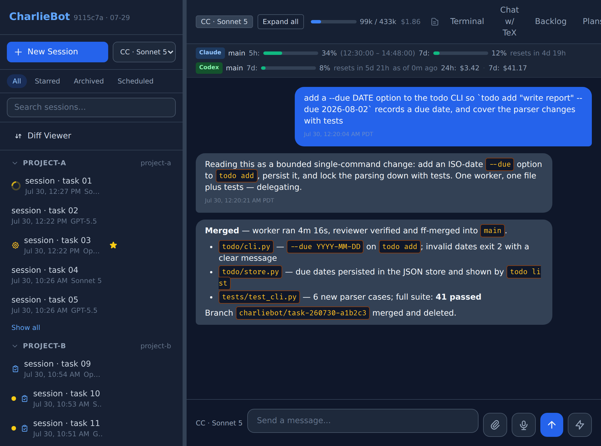
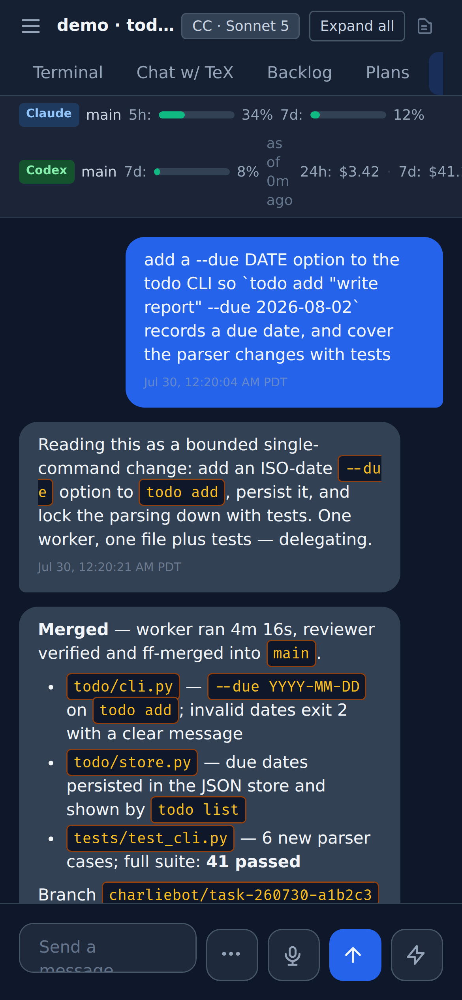
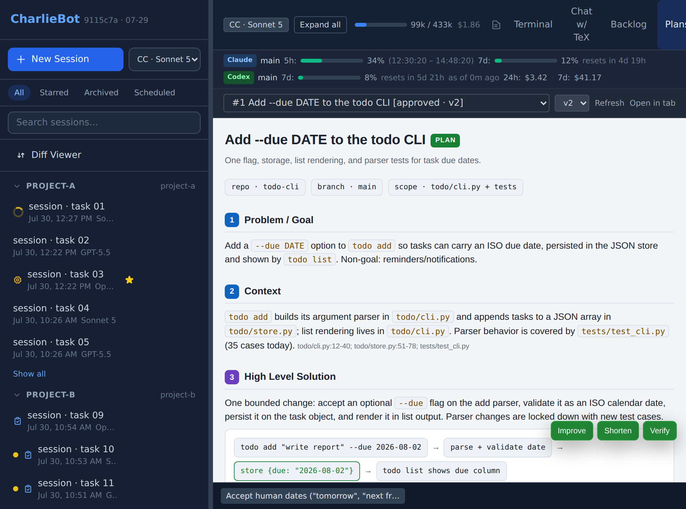

# CharlieBot

CharlieBot is a self-hosted multi-agent orchestration system: a master agent drives worker and reviewer agents across pluggable LLM CLI backends, operated through a web UI.

## Features

### Orchestration

- Master/worker/reviewer delegation in isolated git worktrees with ff-only merge
- Pluggable backends: Claude Code, Codex, Gemini CLI, OpenCode, Charlie Code, Antigravity CLI
- `charliebot improve` autonomous change-run-verify iteration loops
- Plan registry (`charliebot plan`) with HTML plan artifacts and anchored comments

### Automation

- Cron scheduled tasks in prompt, handler, and loop modes
- Delayed triggers (`charliebot schedule-trigger`) watching local/remote PIDs and SLURM jobs; one trigger can watch many targets
- `charliebot remote-launch` for long-running remote commands
- Slash commands hot-reloaded from YAML

### Knowledge

- Memory store: labeled entries with topic/audience scoping, queried mid-session via `charliebot memory`
- Skills system: repo-shared (`skills/`) plus host-specific skills
- YAML backlog with status tracking and auto-commit

### Web UI

- Streaming chat over WebSockets
- Sessions sidebar with groups, filters, and search; star / archive / fork / rate sessions
- Worker (thread), plan, backlog, and context panels
- HTML artifact viewer with line-anchored comments
- GitHub-style diff viewer with diff comments
- Perfetto and NCU trace viewers
- Built-in web terminal (tmux)
- LaTeX panel
- Voice input with local speech transcription (sherpa-onnx SenseVoice)
- Usage panels: external provider quotas and per-session context usage
- File browser (`/files/`) and file uploads
- Access-key auth

### Integrations

- code-server proxying (browser VS Code)
- Anthropic Messages-compatible proxy endpoint (`POST /api/anthropic-proxy/openai-compatible/{backend_id}/v1/messages`) fronting OpenAI-compatible backends

## Screenshots

<p align="center">
  
</p>
<p align="center"><i>Desktop: chat view with the external-provider quota strip (Claude/Codex) and the per-session context usage indicator. Dollar values shown are fabricated demo data.</i></p>
<p align="center">
  
</p>
<p align="center"><i>Mobile: the same chat and session list in a phone-width layout.</i></p>
<p align="center">
  
</p>
<p align="center"><i>Plans: an approved plan's HTML artifact in the viewer — plan/version switchers, revision badges, and resolved trade-offs from the approval lifecycle.</i></p>

## Prerequisites

- Python ≥ 3.12 and git (worker tasks run in git worktrees)
- Node.js is only needed for frontend development

## Quick start

```bash
./scripts/setup.sh   # sync skills, provision ~/.charliebot/, seed repo-default cron tasks
# fill in secrets in ~/.charliebot/config.yaml: gemini_api_key, charliebot_access_key
./scripts/start-server.sh
```

`setup.sh` provisions `~/.charliebot/` (home layout, memory store scaffold, `config.yaml` from `configs/config.example.yaml`) and seeds repo-default cron tasks into `~/.charliebot/config.d/cron.yaml`. Server startup never writes `cron.yaml` — only `setup.sh` does — so re-run `setup.sh` after pulling to pick up new repo-default cron tasks and skills.

## CLI at a glance

- `charliebot delegate` — delegate a task to a worker agent
- `charliebot improve` — start an iterative improvement loop
- `charliebot memory` — query and stage entries in the memory store
- `charliebot plan` — register, amend, approve, and close plans
- `charliebot remote-launch` — launch a long-running remote command
- `charliebot schedule-trigger` — schedule a delayed trigger (timed or watching PIDs/SLURM jobs)
- `charliebot gc-trash` — inspect and purge quarantined worktree trash

## Repository layout

- `src/agents/` — backend harnesses
- `src/api/` — FastAPI routers
- `src/cli/` — `charliebot` subcommand entrypoints
- `src/core/` — spawner, improve loop, scheduler, triggers, sessions, memory, config
- `web/` — Jinja2 templates + vanilla JS static assets
- `skills/` — repo-shared agent skills
- `prompts/` — agent prompt definitions
- `scripts/` — setup, skill sync, server launcher
- `tests/` — pytest suite
- `configs/` — example config and repo-default cron tasks
- `docs/` — supplementary documentation and assets
- `backlog/` — YAML backlog

## License

MIT — see [LICENSE](LICENSE).
